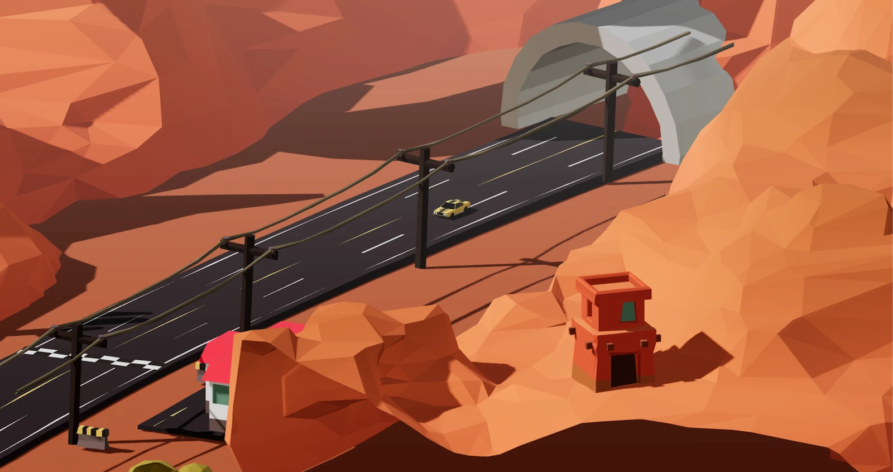

# 🏎️ racing-game



This project is a showcase for the feasibility of React in gaming. Every thing is a self contained component using [react-three-fiber](https://docs.pmnd.rs/react-three-fiber) to express threejs with React semantics. If that seems strange to you read [this explanation](https://twitter.com/0xca0a/status/1282999626782650368).

```jsx
/assets   - the blend files
/utils    - game state store, helpers
/models   - gltfjsx models, players, characters
/effects  - dust, trails, skids, shaders
/ui       - intros, heads up displays, leaderboards
```